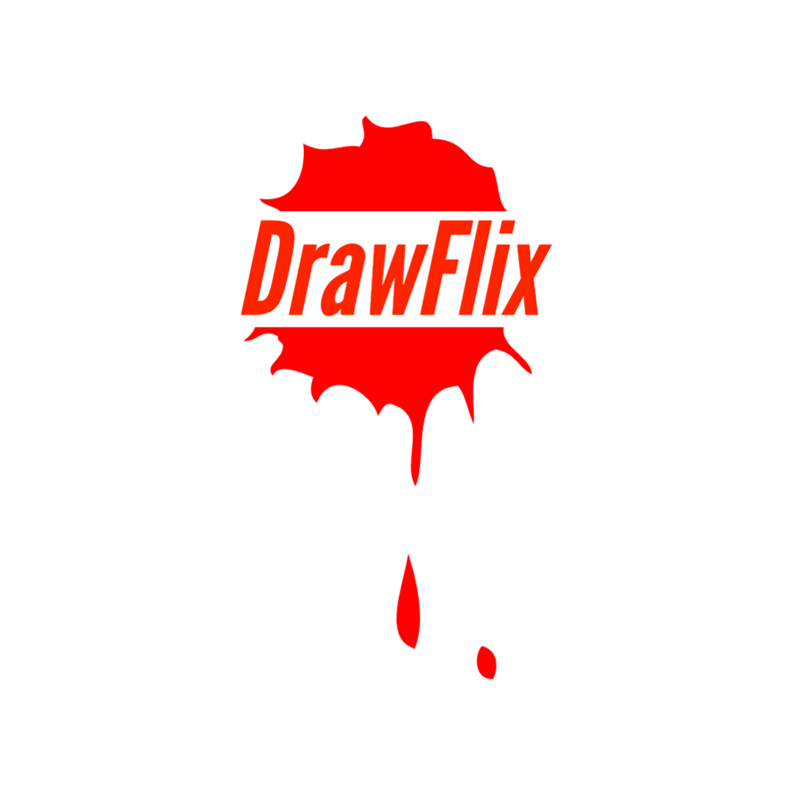

  

   # [DrawFlix](https://drawflix.netlify.app/)
     A video library where you can learn to draw.

#### Stack Used

- React
- SCSS with Bubbles - Component Library
- Javascript

#### Built With -

- Context + useReducer
- React Router v6

# Features

- Home page
- Video listing page
- Filter Videos by Categories
- Search video
- Individual video page
- Like/Unlike a video
- Add/Remove video from Watch Later
- History management
    - Add video to history after you watched a video
    - Remove video from history
    - Clear history
- Playlist management 
    - Create a playlist
    - Delete a playlist
    - Add a video to multiple playlist
    - Remove video from a playlist
- Authentication: 
    - User Signup 
    - User Login
- Responsive

# Demo

  

